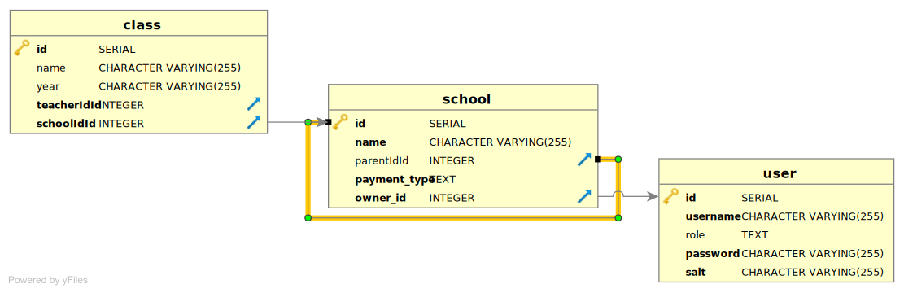

## Tổng quan

### Công nghệ sử dụng

API này được viết bằng NestJS (sử dụng Typescript), với TypeORM (Postgresql) làm database.
Dùng OpenAPI Swagger để quản lý các API, JSON Web Token để chứng thực người dùng.
Mô hình quan hệ giữa các bảng như hình sau:

Riêng bảng School được thiết kế như sau:

User được phân quyền với 4 role : HQ, school_owner, school_teacher và user, 3 role đầu tiên thỏa mãn requirement của bài toán, riêng role user (default khi sign-up) không có quyền hạn gì (sẽ được mở rộng nếu cần thiết).

---
**HQ Role Requirement**

Sau khi đọc kỹ yêu cầu bài toán, có đoạn "*HQ role can export list of activities for every school they owned*", tuy nhiên, **payment_type** là thuộc tính ở từng School, HQ role có thể quản lý nhiều School, bao gồm cả School free plan và School paid plan, do đó chưa xác định được việc "*have to select school_id every time they want to export*". Nên tạm thời đưa vào _future work_

---

Xem [hướng dẫn cài đặt & chạy project](/README.md) và  [Migrate & Seed Database](./database.md) 

### Tiến độ 

- [x] School Teacher can only export list of activities for the class they've been assigned
- [x] School Owner can export list of activities for every class in their school with:
  - [x] paid plan 
  - [x] free plan
- [x] HQ role can export list of activities for every school they owned with: 
  - [x] paid plan 
  - [ ] free plan
- [ ] Paid plan 1 sheet (CSV) for each class (school_owner role)/school (HQ role)
- [x] Authentication/Authorization(JWT)
- [x] Seeding data with Faker
